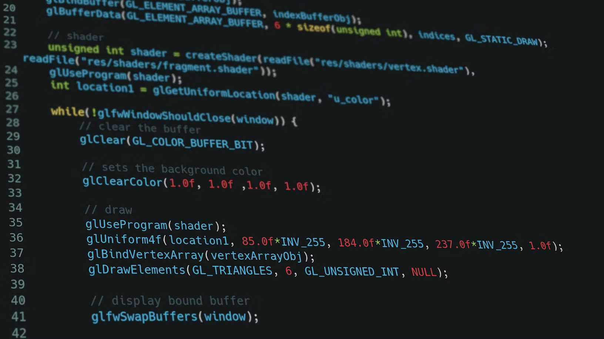
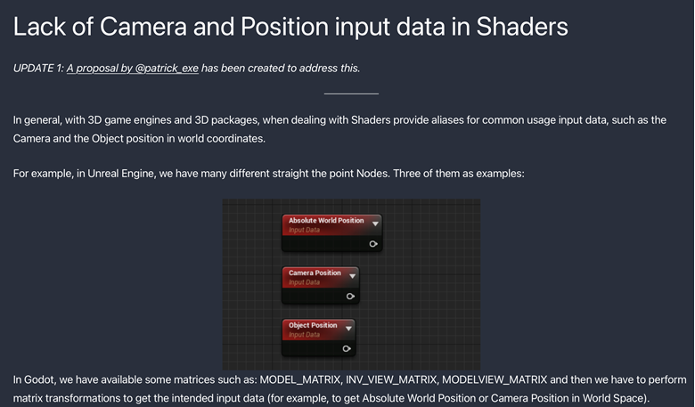

The Godot Engine is nowadays one of most popular game engines (next to Unreal Engine and Unity) and that while being open-source and free to use without any royalties. There are LOTS of people contributing to the engine and I am very happy that I can now count myself to them. In this blog post, I want to explain how I got started contributing to Godot after being in awe for quite a while. I hope you can learn a bit from my experience and take something useful away here.

# First a few things about my journey with Godot:

I personally stumbled upon Godot in 2020 during the Covid-19 crisis and the following lockdown. I was quite upset before with my use of the Unity Engine. Like many, I had my first contact with game development messing around with objects and assets in there.
However cool all these possibilities were, I felt like Unity was overwhelming me with options and no clear path. Even with all the professional made tutorials by Unity itself, I felt lost. With more knowledge working with the engine though, I got more and more into it and also more and more frustrated with several problems I had with it.
The most annoying one I had (that still annoys the heck out of me) is working with git and Unity together. Having first class VCS (version-control system) support is extremely important to me as someone who has several operating systems, works on them interchangeably and always needs the latest version of his work synched across.
After finally deciding to break up with Unity due to my issues with it, I searched for a good replacement and found Godot after trying out some alternatives such as [Panda3D](https://www.panda3d.org/) (C++-based engine/framework with Python bindings, originally made by Disney and now open-source) and [PyGame](https://www.pygame.org/) (Python 2D GameDev framework).

Godot hit all my favourite spots: cross-platform, excellent VCS support (thanks to being text-based from project file to resources), no fees for licensing (which makes more sense for bigger teams but is still pretty cool) and of course - the crême de la crême: being open-source (there are obviously many more cool features but these directly made me fall in love with Godot).

After getting to know the engine for two years now and messing around with virtually anything, I wanted to give my thanks to all the cool people who already improved the engine to its current state and I wanted to give it my own handprint (contribute to it). Having never programmed with C++ (even though I have some Java experience from school which made itself later useful), I didn't feel quite ready to contribute to the main engine repository. So first, I stalked the godot issues, pull-requests, the "good first issue" tag there and the other Godot-related repositories. I contributed some German translations for the class reference which was sometimes quite confusing since the passages were taken out of context. This made it sometimes REALLY hard for a context-based language like German. I quickly lost an interest in this due to this.
My very first "real" contribution to Godot as a whole was when I [added the MacOS target platforms names for the GDExtension example file to the godot-cpp README](https://github.com/godotengine/godot-cpp/pull/685). (Btw if any core contributor reads this: The "Thanks" at the end of the merged PR really boosts motivation (at least for me), so I please never stop with this!).
After getting pumped up with motivation I got more active on [RocketChat](https://chat.godotengine.org/) (the main communication platform for Godot contributors, discussions about implementations and questions around implementations, reviews, feedback etc.). I noticed that there was a mistake with the Sky Shader Example in the Documentation when I filed an issue after not being able to compile the example sky shader from the docs and Clay John (Godot Rendering Lead) corrected my assumption that the "main" function to manipulate the sky appearance in 4.0 is called ``sky()`` and not ``fragment()``. He filed a bug report accordingly and let me know that the issue would be tracked independently from my original issue. Since this was quite an "easy" thing to correct, I got to work and [put in my first godot-docs PR](https://github.com/godotengine/godot-docs/pull/5719)!

I continued my work on the docs and with some shader knowledge I gathered, I noticed together with [NekotoArts](https://ko-fi.com/nekoto) that they were lacking information on the retrieval of important and often-used variables like the Object's World Space Position, the Camera's World Space Position etc. So I [added them in my next PR](https://github.com/godotengine/godot-docs/pull/5895). These variables have specific built-in nodes in Unity or Unreal Engine so having this not directly built-in or at least mentioned in the docs was quite a nuisance before. No more! Additionally I [created a 3.x variant of this PR](https://github.com/godotengine/godot-docs/pull/5963) so people using this line of Godot could benefit from these docs changes as well.

Spatial Shader Reference Documentation: Common Variables calculated using the matrix built-ins

After some time, [Alfred Reinold Baudisch](https://twitter.com/AlfredBaudisch) created a blog post on his website sharing the limitations he experienced working with Godot's 3D Workflow. One of these were the lack of built-in nodes like the Object's World Space Position and the Camera's World Space Position. We got in contact via Twitter and I [created a proposal detailing the idea of adding these nodes as built-in nodes to the engine](https://github.com/godotengine/godot-proposals/issues/4957). It got quite some support on the proposal.

A cutoff from Alfred's website detailing the lack of Camera and Position input nodes for the Visual Shader system

Having had the ambition to contribute to the engine itself for a long time I saw the perfect opportunity. I just didn't really know where to start. Which files do I need to modify and how exactly? I still didn't really know how the internals worked even after watching issues and PRs for quite a while. I remembered though what a very wise man (my dad) told me in those kind of situations: **"Asking questions doesn't cost anything"**. So I did. I asked Clay John on RocketChat what files I needed to mess with to add these nodes to the list of built-in Visual Shader nodes and he answered with a list of all the things I needed to do (I don't think I would have been able to get this information just by sifting through the source code without guidance so this was really appreciated ). After opening the draft PR to get some early feedback, Calinou asked if adding these built-ins to Godot's shader language would also be arguably in everyone's interest. Definitely! I added them shortly after. So there we have my very first contribution to the Godot Engine! [I shared my PR on Twitter and it got VERY positive feedback](https://twitter.com/patrick_exe/status/1553065056639885313), especially once [it got merged](https://twitter.com/patrick_exe/status/1563772649104461825)! I was very moved by all the positive feedback I got. I [backported this PR to the 3.x line (available in 3.6)](https://github.com/godotengine/godot/pull/63971) even so the next line of 3.6 should have this nice addition as well.

All in all I can say that contributing to Godot (whether it's the godot-docs, godot-cpp or the main engine repo), it's HELLA fun! I want to thank everyone involved in giving me a nudge and do this. Most importantly I want to thank all the core contributors for their ongoing support, availability to ask questions and kindness to newcomers like me. You are **AWESOME**! I am looking forward to working more with you! 

Feature Image by [Krishna Pandey](https://unsplash.com/@krishna2803) on Unsplash

