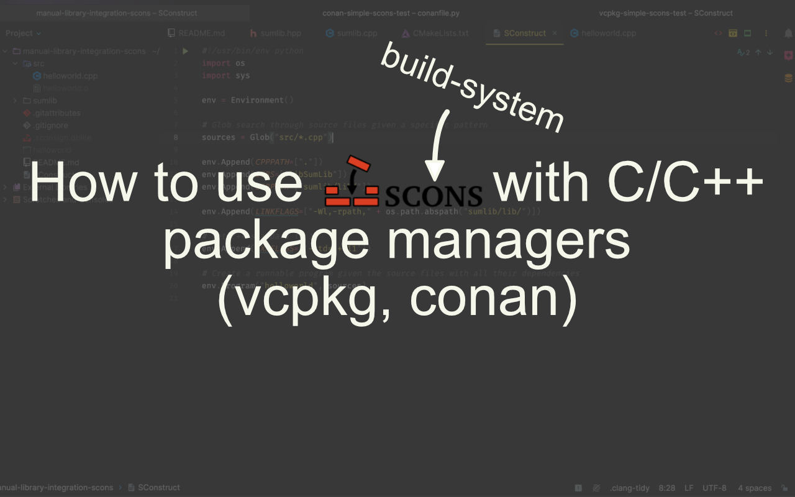

## Introduction
As you know from perhaps my previous articles on [how to contribute to Godot](https://paddy-exe.github.io/posts/contributing-to-godot-visual-shader-nodes/),
[creating your own GDExtension](https://paddy-exe.github.io/posts/gdextension-how-to-write-your-first-extension/) or from the official Godot docs,
Godot uses the [SCons build-system](https://scons.org/) to compile the engine code written in C++ to an executable.
SCons tells the compiler specifically HOW to build together that executable.
Another build-system you will have probably heard of is the widely popular and de-facto industry standard CMake.

These build-systems help you not only to compile your own code but also to combine your code together with C++ code others have written as libraries.
These libraries also get updates so if you use several libraries in your projects it can get quite tedious managing everything.
Here come software package manager to your rescue. They let you "install" a library into your project (meaning they download that source code and compile it)
and then hold a record of which libraries with what version you have "installed" in your project.

The best known software package manager for C and C++ are [vcpkg](https://vcpkg.io/en/) and [conan](https://conan.io/).
Both have a lot of features in common and are different in more advanced use-cases in which I won't go into here.
Both have excellent support for CMake since - again - it is the de-facto standard. However, how do you use them with the SCons build-system?

## Requirements
If you want to follow along this post, you will need recent versions of following software installed:
- Python
- SCons
- CMake
- C++ compiler

## The manual way
To understand how SCons can generally be used with third-party libraries we will first explore the manual way of integrating libraries into our codebase .
This will later help to understand how it can be done with package managers as well and will show how they help us. So let's create an example project.

### Project structure

> [!INFO]
> No need to recreate the following project structure yourself by hand. You can check it out [here](https://github.com/paddy-exe/manual-library-integration-scons)

Let's consider the following project structure:

```sh
manual-library-integration-scons/ # root folder name
|
+--src/                   # source code of the program
|   |                     # we are building
|   +--helloworld.cpp
|   +--helloworld.h
|
+--sumlib/                # folder of the "external" shared library
|   |
|   +--CMakeLists.txt
|   +--sumlib.cpp
|   +--sumlib.h
|
+--SConstruct             # SCons build file
```

### Library files

The `sumlib` folder only contains the library code which will be compiled to a dynamic library. Here we have it inside 
our project structure directly, but you can also consider the same procedure when using [git submodules](https://git-scm.com/book/en/v2/Git-Tools-Submodules).

The contents of the files are purposefully written simple. We are merely creating a class with a static function that
can add two integers together and returns the result. 

```cpp
// sumlib.hpp header file
class SumLib {
public:
    static int add_two(int p_val_a, int p_val_b);
};
```

```cpp
// sumlib.cpp source file
#include "sumlib.hpp"

int SumLib::add_two(int p_val_a, int p_val_b) {
    return p_val_a + p_val_b;
}
```

The more complicated part of this setup is the `CMakeLists.txt` file.

```cmake
# set the minimum required cmake version to compile our library
cmake_minimum_required(VERSION 3.10)

# important for building for both archs on Mac
# will be ignored on non-Apple platforms
set(CMAKE_OSX_ARCHITECTURES "arm64;x86_64" CACHE STRING "" FORCE)

# name the project
project(SumLib)

# set the C++ standard and if it should be required by the compiler to build
set(CMAKE_CXX_STANDARD 11)
set(CMAKE_CXX_STANDARD_REQUIRED ON)

# set a variable for all source files
set(SOURCE_FILES
    sumlib.cpp
)

# set a variable for all header files
set(HEADER_FILES
    sumlib.hpp
)

# set where the cmake should output the compiled library
set(CMAKE_LIBRARY_OUTPUT_DIRECTORY ${CMAKE_BINARY_DIR}/lib/)

# instruct cmake to compile the header and source files to a shared library
add_library(SumLib SHARED ${HEADER_FILES} ${SOURCE_FILES})
```

### Main source file

Our `src` folder has the following contents.

> [!NOTE]
> Have a look at the line `#include "sumlib/sumlib.hpp"`. The `include` preprocessor has no relative path to the file we are including.
> Generally it is recommended to have only paths from the root of your project and avoid `include` starting with `../` to have it easier when
> you want to restructure your project later on.
> This can be set by your build-system or the IDE you are using (in Visual Studio or XCode at least) or alternatively by altering the
> ``CPPPATH`` variable from your build-system.

```cpp
// helloworld.cpp source file
#include "sumlib/sumlib.hpp"
#include <iostream>

int main() {
    std::cout << SumLib::add_two(5, 2);
    std::cout << "\n";
    return 0;
}
```

Here we are including the ``iostream`` library to be able to output a string to the console. Also, we are using a relative path for our library
since it is in our project structure.

### Setting up the SConstruct file

The SConstruct build file in the root directory for calling SCons looks like this:
```py
#!/usr/bin/env python
import os
import sys

env = Environment()

# Glob search through source files given a specific pattern
sources = Glob("src/*.cpp")

env.Append(CPPPATH=["."])
env.Append(LIBS=["libSumLib"])
env.Append(LIBPATH=["sumlib/lib/"])

env.Append(LINKFLAGS=["-Wl,-rpath," + os.path.abspath("sumlib/lib/")])

# set c++ standard to 11
env.Append(CXXFLAGS=['-std=c++11'])

# Create a runnable program given the source files with all their dependencies
env.Program("helloworld", sources)
```

We are first creating a [construction environment variable](https://scons.org/doc/0.97/HTML/scons-user/c1051.html). 
SCons fills this automatically upon creation with default settings based on our running system. By appending values to this
environment we can configure the build process in which SCons tells the compiler how the program should be built.

Next up, we are collecting all the source files via the [`Glob` function](https://scons.org/doc/latest/HTML/scons-user/apd.html#f-Glob)
using a specific pattern. Since we need every file in the `src` directory we use the wildcard character `*`.

Now, the [`CPPPATH`](https://scons.org/doc/0.92/HTML/scons-user/x537.html) environment variable is for telling the 
compiler where to find the dependencies you are referencing in your files with `include` statements.

The [`LIBS` variable](https://scons.org/doc/1.2.0/HTML/scons-user/a4774.html#cv-LIBS) sets the name of libraries which 
will be linked to your program.

[`LIBPATH`](https://scons.org/doc/1.2.0/HTML/scons-user/a4774.html#cv-LIBPATH) is the variable for the paths where SCons 
will search for the libraries you are linking to your program. Since CMake will output the dynamic library into the `lib`
folder we add this path here.

Specifically for macOS we need to set extra arguments for `LINKFLAGS`, as we are adding an extra path to the `rpath` via the
`-rpath` linker flag so macOS or Linux know where the library is when running the program we created. 

> [!INFO]
> `rpath` is the **r**un-time search **path** on Linux and macOS where your executable looks for dynamic libraries. 
> On macOS for instance it is usually located inside the `*.app/Frameworks` folder. 
> You can read more about this topic [here](https://duerrenberger.dev/blog/2021/08/04/understanding-rpath-with-cmake/) and 
> [here](https://squareys.de/blog/rpath-for-dummies/) 

In addition, we are setting the C++ standard to version 11 using the `CXXFLAGS` environment variable.

Lastly, we tell SCons to compile the given source files to an executable with the name `helloworld`.

### Compiling the program

To build the executable you need to call SCons in your top project path by using

```sh
scons
```

### Running the program

If compiled this program and everything worked you will have created an executable called ``helloworld`` as described above in the SConstruct file.
Now, if you run this program by calling

```sh
./helloworld    # this might have different filenames on e.g. Windows so be sure to add those here too
```

You will now receive the following output in the console:
```sh
7
```

Congrats!!!🥳🥳🥳 Now you know the basics of using SCons with external libraries. Let's explore how to use it with package managers further down.

## The package manager way
As we now have a better understanding of the different environment variables of the SCons built-system, let's explore
how we can integrate C++ package managers here. For the following examples we will integrate the 
[`fmt` formatting library](https://github.com/fmtlib/fmt) with both vcpkg and conan.

### vcpkg

> [!INFO]
> No need to recreate the following project structure yourself by hand. You can check it out [here](https://github.com/paddy-exe/vcpkg-simple-scons-test)

For using the vcpkg package manager we assume similarly to the last section the following folder structure:

```sh
vcpkg-simple-scons-test/ # root folder name
|
+--src/                   # source code of the program
|   |                     # we are building
|   +--helloworld.cpp
|   +--helloworld.h
|
+--SConstruct             # SCons build file
```

Next up, we will install vcpkg. For that, you will first need to clone vcpkg to a folder of your choice on your system.

> [!NOTE]
> If you want to set up your project to use a CI/CD pipeline like GitHub Actions you will want to move the `vcpkg` install
> folder inside your project as a git submodule. In this example we will follow the 
> [official docs instructions](https://learn.microsoft.com/en-us/vcpkg/get_started/get-started?pivots=shell-powershell) 
> instead. If you already have vcpkg installed, you can skip this section.

#### Installation of vcpkg

1. Clone the project via `git clone` on your system
```sh
git clone https://github.com/microsoft/vcpkg.git
```

2. Change into the directory
```sh
cd vcpkg
```

3. Execute the bootstrap script
```sh
.\bootstrap-vcpkg.bat
```

4. Set the environment variables to the path of your vcpkg installation directory
```sh
VCPKG_ROOT = "C:\path\to\vcpkg" # tells vcpkg where it is installed
PATH = "VCPKG_ROOT"             # add VCPKG_ROOT to your path variable
```

#### Setting up vcpkg for the project and installing dependencies

1. Change into the project directory / Open the project path in the terminal
```sh
cd vcpkg-simple-scons-test/
```

2. Create a new ``vcpkg`` "application" and thereby a manifest file `vcpkg.json` in your project directory which gives ``vcpkg`` information which dependencies 
you want installed.
```sh
vcpkg new --application
```

> [!WARNING]
> If you get any errors calling `vcpkg` here saying vcpkg is not a known command your ``PATH`` variable may not have been set/updated correctly.

3. Next up we will add the `fmt` library dependency to our `vcpkg.json`
```sh
vcpkg add port fmt
```

It should now look like this:
```json
{
    "dependencies": [
        "fmt"
    ]
}
```

4. In your project directory instruct vcpkg to install the dependencies described in the `vcpkg.json`
```sh
vcpkg install
```

If that step has worked correctly you should now have a new folder inside your project directory called `vcpkg_installed`. 
In there you will see two folders. One named `vcpkg` which contains some internal vcpkg configuration files.
The other one will be named after your system configuration. If you are on Windows, it will be called something like `x64-windows`
and similarly if you are on macOS or Linux. In there you can find the library header files for the installed `fmt` library 
(inside `include/fmt`) and the dynamic library in `lib/libfmt.*` (The "*" asterisk is here a placeholder for the file suffix specific to your running system).

#### Main source file
Next up, let's go through the ``helloworld.cpp`` file content. Similarly to the section when integrating a library manually, we are including the ``fmt`` library.

```cpp
// helloworld.cpp source file
#include <fmt/core.h>

int main() {
    fmt::print("Hello World!\n");
    return 0;
}
```

Instead of using the standard library we are including the ``fmt`` library and use its print function to output ``Hello World!`` to the console.

Now to finish everything up we will create a new SConstruct file specific to this setup.

#### Setting up the SConstruct file

For now copy this content below, and we will go through it again for the content that is specific to vcpkg.

```py
#!/usr/bin/env python
import os
import sys

env = Environment()

# Glob search through source files given a specific pattern
sources = Glob("src/*.cpp")

if sys.platform == "darwin":
    vcpkg_lib_path = "vcpkg_installed/"
    env.Append(CPPPATH=["vcpkg_installed/arm64-osx/include"])
    env.Append(LIBPATH="vcpkg_installed/arm64-osx/lib/")
elif sys.platform == "win32" or sys.platform == "msys":
    env.Append(CPPPATH=["vcpkg_installed/x64-windows/include"])
    env.Append(LIBPATH="vcpkg_installed/x64-windows/lib/")
elif sys.platform == "linux":
    env.Append(CPPPATH=["vcpkg_installed/x64-linux/include"])
    env.Append(LIBPATH="vcpkg_installed/x64-linux/lib/")
else:
    print("Your system is not supported by the the SConstruct file. Exciting.")
    env.Exit(1)

# set c++ standard to 11
env.Append(CXXFLAGS=['-std=c++11'])

# set name of library/ies to be linked
env.Append(LIBS=["libfmt"])

# Create a runnable program given the source files with all their dependencies
env.Program("helloworld", sources)
```

The main differences between the vcpkg version and the manual way are two-fold:
1. You have to specify a lot of boilerplate code for each operating system to handle the different `CPPPATH`'s and `LIBPATH`'s. 
This could perhaps be handled differently by giving `vcpkg` instructions to package every platform library together. I haven't found such a solution (yet).
2. You don't need to specify the `rpath` anymore. This will be automatically handled by `vcpkg`.

Your final project structure should now look something like this:

```sh
vcpkg-simple-scons-test/      # root folder name
|
+--src/                       # source code of the program
|   |                         # we are building
|   +--helloworld.cpp
|   +--helloworld.h
|
+--vcpkg_installed/           # location of installed libraries sources and binaries and configuration information
|   |                     
|   +--arm64-osx/             # will be named differently for each running platform
|   |
|   +--vcpkg/             
|
+--SConstruct                 # SCons build file
|
+--vcpkg-configuration.json
|
+--vcpkg.json                 # vcpkg library configuration json
```

#### Compiling the program
To build the executable you need to call SCons in your top project path:

```sh
scons
```

#### Running the program

If compiled this program and everything worked you will have created an executable called ``helloworld`` as described above in the SConstruct file.
Now, if you run this program by calling

```sh
./helloworld    # this might have different filenames on e.g. Windows so be sure to add those here too
```

You will now receive the following output in the console:
```sh
Hello World!
```

Congrats!!! 🥳🥳🥳 Now you know how to integrate third-party libraries using vcpkg into your build process with SCons.

### conan

> [!INFO]
> No need to recreate the following project structure yourself by hand. You can check it out [here](https://github.com/paddy-exe/conan-simple-scons-test)

For using the conan package manager we assume similarly to the last sections the following folder structure:

```sh
conan-simple-scons-test/ # root folder name
|
+--src/                   # source code of the program
|   |                     # we are building
|   +--helloworld.cpp
|   +--helloworld.h
|
+--SConstruct             # SCons build file
```

#### Installation of conan

You can install conan via your Python's pip CLI tool like this:

```sh
pip install conan
```

Alternatively you can use software package managers such as brew (macOS, Linux) or scoop (Windows).

#### Creating conanfile.py

To use conan you need to configure how it should work. Conan has integrations for various build-systems such as CMake and SCons.
This means that conan will generate files for the build-system so it knows where the library files are.
Since we are using SCons we will have to specify that which will make it easier for us later on. 
Also, we have to set which library we want to be installed (in our case here the ``fmt`` library).

We will then create the ``conanfile.py`` file with the following content.

> [!NOTE]
> You could alternatively write ``conanfile.txt`` files as well, but I would recommend directly 
> getting used to the python syntax as it supports more complex setups and scripting support such as with SCons.

```py
from conan import ConanFile

class ExampleRecipe(ConanFile):
    generators = "SConsDeps"

    def requirements(self):
        self.requires("fmt/11.0.2")
```

We are creating a class for our recipe which conan will use to build our libraries. The class depends on
the conan class ``ConanFile``. Next up, we will use the ``SConsDeps`` generator for SCons. If you want to 
change how conan will generate the necessary files so e.g. you can use different build-systems on Windows and macOS
you can specify that in the [``generate()``](https://docs.conan.io/2/reference/conanfile/methods/generate.html#generate) method. 
This would be out of bounds for this blog post, so we will only use the given generator.

In the ``requirements()`` method we specify which library (and optionally which version) we want to install.
Here we specify the ``fmt`` library with the version ``11.0.2``.

The given library/libraries has/have to be present in the [ConanCenter](https://conan.io/center) since conan will use the recipes stored
there to figure out where to download and how to compile the libraries. You can also [create your own recipe](https://docs.conan.io/2/tutorial/creating_packages/create_your_first_package.html) 
if the library you want to use doesn't have a recipe available. Explaining how that can be done is also out of scope for this post
so can take a look at the official documentation.

#### Main source file

The ``helloworld.cpp`` file is the same as in the vcpkg section:

```cpp
// helloworld.cpp source file
#include <fmt/core.h>

int main() {
    fmt::print("Hello World!\n");
    return 0;
}
```

Instead of using the standard library we are including the ``fmt`` library and use its print function to output ``Hello World!`` to the console.

#### Setting up conan for the project and installing dependencies

1. Run conan with the following commands to let conan create a build profile for your development environment.
This will contain information such as the C/C++ compiler, the operating system, chip architecture and more.
This file can be edited manually as well. conan will use the command to guess the best fitting profile.
```sh
conan profile detect --force
```

2. Change into the project directory / Open the project path in the terminal
```sh
cd conan-simple-scons-test/
```

3. Call conan to download and compile the libraries specified by the ``conanfile.py`` (or ``.txt``) file

```sh
conan install . --output-folder=build --build=missing
```

Within the arguments we are specifying with the ``--output-folder`` where the generated files should be placed in.
The ``--build`` flag specifies which libraries dependencies should be built from source. Conan by default caches 
already built libraries to not unnecessarily build them every time. By setting it to ``missing`` we set it to only
compile the ones which are not already locally cached.

This step will generate the file important for SCons to know where the libraries and their source code are located.
This file is called ``SConscript_conandeps`` and looks like this:

```py
conandeps = {


        "conandeps" : {
            "CPPPATH"     : ['/Users/patrick/.conan2/p/b/fmt37ee0f216967f/p/include'],
            "LIBPATH"     : ['/Users/patrick/.conan2/p/b/fmt37ee0f216967f/p/lib'],
            "BINPATH"     : ['/Users/patrick/.conan2/p/b/fmt37ee0f216967f/p/bin'],
            "LIBS"        : ['fmt'],
            "FRAMEWORKS"  : [],
            "FRAMEWORKPATH" : [],
            "CPPDEFINES"  : [],
            "CXXFLAGS"    : [],
            "CCFLAGS"     : [],
            "SHLINKFLAGS" : [],
            "LINKFLAGS"   : [],
        },
        
        

        "fmt" : {
            "CPPPATH"     : ['/Users/patrick/.conan2/p/b/fmt37ee0f216967f/p/include'],
            "LIBPATH"     : ['/Users/patrick/.conan2/p/b/fmt37ee0f216967f/p/lib'],
            "BINPATH"     : ['/Users/patrick/.conan2/p/b/fmt37ee0f216967f/p/bin'],
            "LIBS"        : [],
            "FRAMEWORKS"  : [],
            "FRAMEWORKPATH" : [],
            "CPPDEFINES"  : [],
            "CXXFLAGS"    : [],
            "CCFLAGS"     : [],
            "SHLINKFLAGS" : [],
            "LINKFLAGS"   : [],
        },
        "fmt_version" : "11.0.2",
        
}

Return('conandeps')
```

You can see that there is a ``conandeps`` python dictionary in which there are two dictionaries. 
One called ``conandeps`` and the other ``fmt``. They again contain keys for ``CPPPATH``, ``LIBPATH``
and ``BINPATH`` which you may recognize from the section about manually integrating libraries.
This is one of the main advantages of a generator/integration of a build-system into a C/C++ package manager. 
When we had to manually define and update those variables ourselves in the previous sections we can now let conan 
take over this tedious task.

This file can be referenced and read by our SConstruct file in the next stage.

#### Setting up the SConstruct file

The SConstruct looks like this:

```py
#!/usr/bin/env python
import os
import sys

env = Environment()

# Glob search through source files given a specific file type pattern
sources = Glob("src/*.cpp")

# You can use conandeps to get the information
# for all the dependencies.
conandeps = SConscript('build/SConscript_conandeps')
conan_flags = conandeps["conandeps"]

# Or use the name of the requirement if
# you only want the information about that one.
fmt_flags = conandeps["fmt"]

# set C++ standard to 11
env.Append(CXXFLAGS=['-std=c++11'])

# Merge flags with optional other predefined flags 
env.MergeFlags(conan_flags)

# Create a runnable program given the source files with all their dependencies
env.Program("helloworld", sources)
```

In this file we are loading the contents via the `SConscript()` method into a `conandeps` object.
From this object we are reading out the different flags. We can choose to read out the flags from
every library which conan installed (here called ``conan_flags``) or only specific library flags 
(here ``fmt_flags``). We merge those flags with the already predefined environment flags using the
``MergeFlags`` method.

#### Compiling the program

To build the executable you need to call SCons in your top project path:

```sh
scons
```

#### Running the program

If compiled this program and everything worked you will have created an executable called ``helloworld`` as described above in the SConstruct file.
Now, if you run this program by calling

```sh
./helloworld    # this might have different filenames on e.g. Windows so be sure to add those here too
```

You will now receive the following output in the console:
```sh
Hello World!
```

Congrats!!!🥳🥳🥳 Now you know how to integrate third-party libraries using conan into your build process with SCons.

## Conclusion

After reading through this (long) post you will have hopefully gained a deeper understanding how library linking
with SCons works and how package managers can help you automate the tedious parts of library version tracking and
compilation setup. I myself learned certainly quite a lot in researching this topic as a C++ learner.
I started this to understand how external libraries can be integrated into Godot using the GDExtension system.
All of this here can also be directly applied with the GDExtension system when using it with the SCons build-system.
This post content will also be contributed in a denser format to the official Godot documentation at a later time 
after publishing.

## Thanks and Support
If you liked this post and would like to support me with a digital hot beverage as a thank you, you can do so 
via my [Ko-Fi](https://ko-fi.com/flamelizard). Thank you very much for reading!
