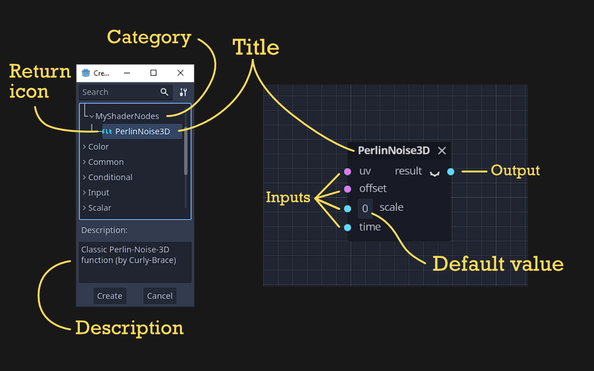

# Introduction
If you have ever wondered how (some) new features are getting added to each new iteration of the Godot Engine, you've come to the right place! In this post I will explain how you can Visual Shader nodes to the core engine [as I have](https://github.com/godotengine/godot/pull/64248) and give a little insight about the internal workings of the Godot source code.

# The Structure of Visual Shaders nodes
To understand how Visual Shader nodes can be written in C++ (even if you have almost no knowledge about C++) we need to have look at how you can create new Nodes in GDScript as addons/tool scripts. There is a [section about this in the docs](https://docs.godotengine.org/en/stable/tutorials/plugins/editor/visual_shader_plugins.html), so let's take a deep-dive into the code:

```gdscript
© Copyright 2014-present Juan Linietsky, Ariel Manzur and the Godot community (CC BY 3.0). Revision c93d9373.

# PerlinNoise3D.gd
@tool
extends VisualShaderNodeCustom
class_name VisualShaderNodePerlinNoise3D

func _get_name():
    return "PerlinNoise3D"

func _get_category():
    return "MyShaderNodes"

func _get_description():
    return "Classic Perlin-Noise-3D function (by Curly-Brace)"

func _init():
    set_input_port_default_value(2, 0.0)

func _get_return_icon_type():
    return VisualShaderNode.PORT_TYPE_SCALAR

func _get_input_port_count():
    return 4

func _get_input_port_name(port):
    match port:
        0:
            return "uv"
        1:
            return "offset"
        2:
            return "scale"
        3:
            return "time"

func _get_input_port_type(port):
    match port:
        0:
            return VisualShaderNode.PORT_TYPE_VECTOR_3D
        1:
            return VisualShaderNode.PORT_TYPE_VECTOR_3D
        2:
            return VisualShaderNode.PORT_TYPE_SCALAR
        3:
            return VisualShaderNode.PORT_TYPE_SCALAR

func _get_output_port_count():
    return 1

func _get_output_port_name(port):
    return "result"

func _get_output_port_type(port):
    return VisualShaderNode.PORT_TYPE_SCALAR

func _get_global_code(mode):
    return """
        vec3 mod289_3(vec3 x) {
            return x - floor(x * (1.0 / 289.0)) * 289.0;
        }

        vec4 mod289_4(vec4 x) {
            return x - floor(x * (1.0 / 289.0)) * 289.0;
        }

        vec4 permute(vec4 x) {
            return mod289_4(((x * 34.0) + 1.0) * x);
        }

        vec4 taylorInvSqrt(vec4 r) {
            return 1.79284291400159 - 0.85373472095314 * r;
        }

        vec3 fade(vec3 t) {
            return t * t * t * (t * (t * 6.0 - 15.0) + 10.0);
        }

        // Classic Perlin noise.
        float cnoise(vec3 P) {
            vec3 Pi0 = floor(P); // Integer part for indexing.
            vec3 Pi1 = Pi0 + vec3(1.0); // Integer part + 1.
            Pi0 = mod289_3(Pi0);
            Pi1 = mod289_3(Pi1);
            vec3 Pf0 = fract(P); // Fractional part for interpolation.
            vec3 Pf1 = Pf0 - vec3(1.0); // Fractional part - 1.0.
            vec4 ix = vec4(Pi0.x, Pi1.x, Pi0.x, Pi1.x);
            vec4 iy = vec4(Pi0.yy, Pi1.yy);
            vec4 iz0 = vec4(Pi0.z);
            vec4 iz1 = vec4(Pi1.z);

            vec4 ixy = permute(permute(ix) + iy);
            vec4 ixy0 = permute(ixy + iz0);
            vec4 ixy1 = permute(ixy + iz1);

            vec4 gx0 = ixy0 * (1.0 / 7.0);
            vec4 gy0 = fract(floor(gx0) * (1.0 / 7.0)) - 0.5;
            gx0 = fract(gx0);
            vec4 gz0 = vec4(0.5) - abs(gx0) - abs(gy0);
            vec4 sz0 = step(gz0, vec4(0.0));
            gx0 -= sz0 * (step(0.0, gx0) - 0.5);
            gy0 -= sz0 * (step(0.0, gy0) - 0.5);

            vec4 gx1 = ixy1 * (1.0 / 7.0);
            vec4 gy1 = fract(floor(gx1) * (1.0 / 7.0)) - 0.5;
            gx1 = fract(gx1);
            vec4 gz1 = vec4(0.5) - abs(gx1) - abs(gy1);
            vec4 sz1 = step(gz1, vec4(0.0));
            gx1 -= sz1 * (step(0.0, gx1) - 0.5);
            gy1 -= sz1 * (step(0.0, gy1) - 0.5);

            vec3 g000 = vec3(gx0.x, gy0.x, gz0.x);
            vec3 g100 = vec3(gx0.y, gy0.y, gz0.y);
            vec3 g010 = vec3(gx0.z, gy0.z, gz0.z);
            vec3 g110 = vec3(gx0.w, gy0.w, gz0.w);
            vec3 g001 = vec3(gx1.x, gy1.x, gz1.x);
            vec3 g101 = vec3(gx1.y, gy1.y, gz1.y);
            vec3 g011 = vec3(gx1.z, gy1.z, gz1.z);
            vec3 g111 = vec3(gx1.w, gy1.w, gz1.w);

            vec4 norm0 = taylorInvSqrt(vec4(dot(g000, g000), dot(g010, g010), dot(g100, g100), dot(g110, g110)));
            g000 *= norm0.x;
            g010 *= norm0.y;
            g100 *= norm0.z;
            g110 *= norm0.w;
            vec4 norm1 = taylorInvSqrt(vec4(dot(g001, g001), dot(g011, g011), dot(g101, g101), dot(g111, g111)));
            g001 *= norm1.x;
            g011 *= norm1.y;
            g101 *= norm1.z;
            g111 *= norm1.w;

            float n000 = dot(g000, Pf0);
            float n100 = dot(g100, vec3(Pf1.x, Pf0.yz));
            float n010 = dot(g010, vec3(Pf0.x, Pf1.y, Pf0.z));
            float n110 = dot(g110, vec3(Pf1.xy, Pf0.z));
            float n001 = dot(g001, vec3(Pf0.xy, Pf1.z));
            float n101 = dot(g101, vec3(Pf1.x, Pf0.y, Pf1.z));
            float n011 = dot(g011, vec3(Pf0.x, Pf1.yz));
            float n111 = dot(g111, Pf1);

            vec3 fade_xyz = fade(Pf0);
            vec4 n_z = mix(vec4(n000, n100, n010, n110), vec4(n001, n101, n011, n111), fade_xyz.z);
            vec2 n_yz = mix(n_z.xy, n_z.zw, fade_xyz.y);
            float n_xyz = mix(n_yz.x, n_yz.y, fade_xyz.x);
            return 2.2 * n_xyz;
        }
    """

func _get_code(input_vars, output_vars, mode, type):
    return output_vars[0] + " = cnoise(vec3((%s.xy + %s.xy) * %s, %s)) * 0.5 + 0.5;" % [input_vars[0], input_vars[1], input_vars[2], input_vars[3]]
```

The meaning behind this can be read in the docs as well but here's a description for each used method so you don't have to look it up yourself:



### `@tool`
Let's this script run in the editor itself instead of only in the running game.

### `VisualShaderNodePerlinNoise3D`
Creates a new class extending from `VisualShaderNodeCustom` via the `extends` keyboard in the prior line.

### `_get_name()`
Sets the title of the Visual Shader node.

### `_get_description()`
Sets the description of the Visual Shader node.

### `_init()`
Sets default values for input ports.

### `_get_return_icon_type()`
Sets the icon type of the Visual Shader node in the `Add Node` dialogue of the Visual Shader editor.

### `_get_input_port_count()`
Sets the number of input ports of the Visual Shader node.

### `_get_input_port_name()`
Sets the Strings for the input ports of the Visual Shader node.

### `_get_input_port_type()`
Sets the type for the input port.

### `_get_output_port_count()`
Sets the number of output ports.

### `_get_output_port_name()`
Sets the String(s) of the output node(s).

### `_get_output_port_type()`
Sets the type of the output port of the node.

### `_get_global_code()`
Sets the global code which is added at the top of the generated written shader file.

### `_get_code()`
Sets the code which is added inside the `vertex`, `fragment` or other function stage of the shader.

# How to add Visual Shader Nodes in C++

Now that we have established how the syntax works in GDScript, let's have a look at the C++ side. Later on, we will create a simple example Node: a node that only returns the UVs of a Mesh.

The files you need to change to create new nodes are:
* ``scene/resources/visual_shader_nodes.cpp``
* ``scene/resources/visual_shader_nodes.h``
* ``scene/register_scene_types.cpp``
* ``editor/plugins/visual_shader_editor_plugin.cpp``

Let's start with the header file:

## ``visual_shader_nodes.h``

In the header file we define the general structure of the methods we want to use. Since we are merely inheriting the `VisualShaderNode`, there is mostly just the same code as in the other Visual Shader Nodes. It can however get more complicated (but that is for later).

If you scroll to the end of the file you will see either this or something similar:

```cpp
...

class VisualShaderNodeRemap : public VisualShaderNode {
	GDCLASS(VisualShaderNodeRemap, VisualShaderNode);

public:
	virtual String get_caption() const override;

	virtual int get_input_port_count() const override;
	virtual PortType get_input_port_type(int p_port) const override;
	virtual String get_input_port_name(int p_port) const override;

	virtual int get_output_port_count() const override;
	virtual PortType get_output_port_type(int p_port) const override;
	virtual String get_output_port_name(int p_port) const override;

	virtual String generate_code(Shader::Mode p_mode, VisualShader::Type p_type, int p_id, const String *p_input_vars, const String *p_output_vars, bool p_for_preview = false) const override;

	VisualShaderNodeRemap();
};

#endif // VISUAL_SHADER_NODES_H
```

This is the part I've written for one my PRs for the Visual Shader system. You might recognize some functions from their GDScript equivalent and will notice that the differences are only limited to some typical C++ syntax keywords like `virtual`, `const` or `override`. But don't let these words intimidate you. Let's first have a detailed look at the unfamiliar methods:

### ``GDCLASS()``
This macro (C++ term for a sort-of function that let's you shorten code among other advantages) uses the underlying ClassDB system to create the class entry so Godot knows that this class exists.

### ``get_caption()``
Sets the title of the Visual Shader Node. C++ equivalent of `_get_name()`.

### ``VisualShaderNodeRemap()``
This is the constructor method of your class. In this method we will also set the default values just like in GDScript's ``_init()`` method.

## ``visual_shader_nodes.cpp``
The C++ part of the new node is also built similarly to the GDScript side with some minor differences. Here is the code:

```cpp
String VisualShaderNodeRemap::get_caption() const {
	return "Remap";
}

int VisualShaderNodeRemap::get_input_port_count() const {
	return 5;
}

VisualShaderNodeRemap::PortType VisualShaderNodeRemap::get_input_port_type(int p_port) const {
	switch (p_port) {
		case 0:
			return PORT_TYPE_SCALAR;
		case 1:
			return PORT_TYPE_SCALAR;
		case 2:
			return PORT_TYPE_SCALAR;
		case 3:
			return PORT_TYPE_SCALAR;
		case 4:
			return PORT_TYPE_SCALAR;
		default:
			break;
	}

	return PORT_TYPE_SCALAR;
}

String VisualShaderNodeRemap::get_input_port_name(int p_port) const {
	switch (p_port) {
		case 0:
			return "value";
		case 1:
			return "input min";
		case 2:
			return "input max";
		case 3:
			return "output min";
		case 4:
			return "output max";
		default:
			break;
	}

	return "";
}

int VisualShaderNodeRemap::get_output_port_count() const {
	return 1;
}

VisualShaderNodeRemap::PortType VisualShaderNodeRemap::get_output_port_type(int p_port) const {
	return PORT_TYPE_SCALAR;
}

String VisualShaderNodeRemap::get_output_port_name(int p_port) const {
	return "value";
}

String VisualShaderNodeRemap::generate_code(Shader::Mode p_mode, VisualShader::Type p_type, int p_id, const String *p_input_vars, const String *p_output_vars, bool p_for_preview) const {
	String code;
	code += "	{\n";
	code += vformat("		float __input_range = %s - %s;\n", p_input_vars[2], p_input_vars[1]);
	code += vformat("		float __output_range = %s - %s;\n", p_input_vars[4], p_input_vars[3]);
	code += vformat("		%s = %s + __output_range * ((%s - %s) / __input_range);\n", p_output_vars[0], p_input_vars[3], p_input_vars[0], p_input_vars[1]);
	code += "	}\n";
	return code;
}

VisualShaderNodeRemap::VisualShaderNodeRemap() {
	set_input_port_default_value(1, 0.0);
	set_input_port_default_value(2, 1.0);
	set_input_port_default_value(3, 0.0);
	set_input_port_default_value(4, 1.0);

	simple_decl = false;
}
```

In the first method we set the title String for the node. Here, we call it ``Remap``. Notice how you write the syntax for methods in C++:

```cpp
ReturnType ClassName::MethodName() additionalKeyword {

}
```

The ``const`` keyword in the context of a class method means that the object it is called upon doesn't change. Just like this, we also write the ``get_input_port_count()`` method but with an ``int`` as a return type.

In the third method ``get_input_port_type()`` we encounter the parameter ``int p_port``. In the Godot source code you will encounter more examples of this type of function parameter namings. With this, it is easier to spot which is in fact a parameter variable passed down and which isn't. This comes in handy when there is more complex functionality programmed into a function. 

The return values here are just like in GDScript e.g. ``PORT_TYPE_SCALAR`` and ``PORT_TYPE_VECTOR_3D``. Other than also having a differnt keyword for switch statements (`switch` in C++ and `match` in GDScript), you have to return a default value in C++ outside of the switch statement.

Every method after that except ``generate_code()`` and ``VisualShaderNodeRemap()`` falls under the already described rules so I won't go into them anymore.

Now for the ``generate_code`` method:
Notice how many parameters there are:
```
Shader::Mode p_mode, VisualShader::Type p_type, int p_id, const String *p_input_vars, const String *p_output_vars, bool p_for_preview
```

You CAN use them but don't have to. They enable you to write more complex shader code depending on many factors. As this method's name suggests, it generates the underlying shader code for the Visual Shader node. For instance the shader code can be completely different between a CanvasItem Shader and a Spatial Shader. But having to write two different kind of variants would be cumbersome and some repeated lines of code.

``Shader::Mode`` is the Shader type so for instance Spatial or CanvasItem Shader. ``VisualShader::Type`` is the specific Shader stage e.g. the ``vertex()`` or ``fragment()`` function. The ``p_id`` is the ID of the Node itself. This is hardly/never used as far as I know. The pointers for the input variables and output variables are used to format the Strings and fill in the values. The ``p_for_preview`` sets which output is used for previewing. The standard behaviour is that it picks the first output.

The body of the method creates a String called ``code`` and then uses the ``vformat()`` function to fill the values of the input variables and output variables into the String.

```cpp
String code;
code += "	{\n";
code += vformat("		float __input_range = %s - %s;\n", p_input_vars[2], p_input_vars[1]);
code += vformat("		float __output_range = %s - %s;\n", p_input_vars[4], p_input_vars[3]);
code += vformat("		%s = %s + __output_range * ((%s - %s) / __input_range);\n", p_output_vars[0], p_input_vars[3], p_input_vars[0], p_input_vars[1]);
code += "	}\n";
return code;
```

To write the shader content to the String we write each line as a seperate String embedded in the ``vformat`` function and add this String to the ``code`` String.

The syntax for the ``vformat`` function is as follows:
```cpp
vformat("		%s", Variable);
```
The ``%s`` sets the space where the variable is supposed to be pasted in. If there are several ``%s`` present, the order of the additional parameters behind the String is parsed through for each item to be replaced.

> :memo: To prevent variable conflicts in the generated shader file we put ``{ }`` around the node's Shader String.

After we wrote each line, we ``return`` the String back.

Now for the ``VisualShaderNodeRemap`` method there is not much to say except that you can set the default input values. I am not sure myself what the boolean ``simple_decl`` means. It isn't necessary to add for the node to function properly.

## ``register_scene_types.cpp``
The file itself is gigantic so search for ``Remap`` to find a line like this:
```cpp
GDREGISTER_CLASS(VisualShaderNodeRemap);
```
This method registers your class so you can use it in GDScript and built on top of it (if you so choose).

## ``visual_shader_editor_plugin.cpp``
This file is also huge so search this time for ``VisualShaderNodeRemap`` to find a line like this:
```cpp
add_options.push_back(AddOption("Remap", "Utility", "VisualShaderNodeRemap", TTR("Remaps a given input from the input range to the output range."), {}, VisualShaderNode::PORT_TYPE_SCALAR));
```

This function adds the details about the correct category of the node, the class it uses, the documentation String which is being shown if you search in the Editor Docs (<kbd>F1</kbd>). If you have specific variants of your Node that changes depending on a dropdown, you set the option variable inside the ``{}``.


