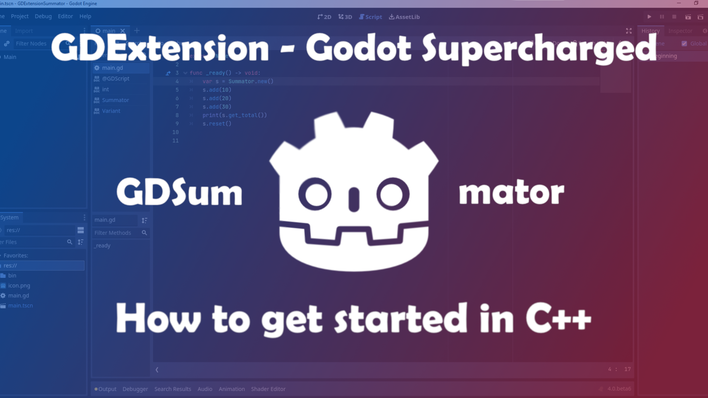
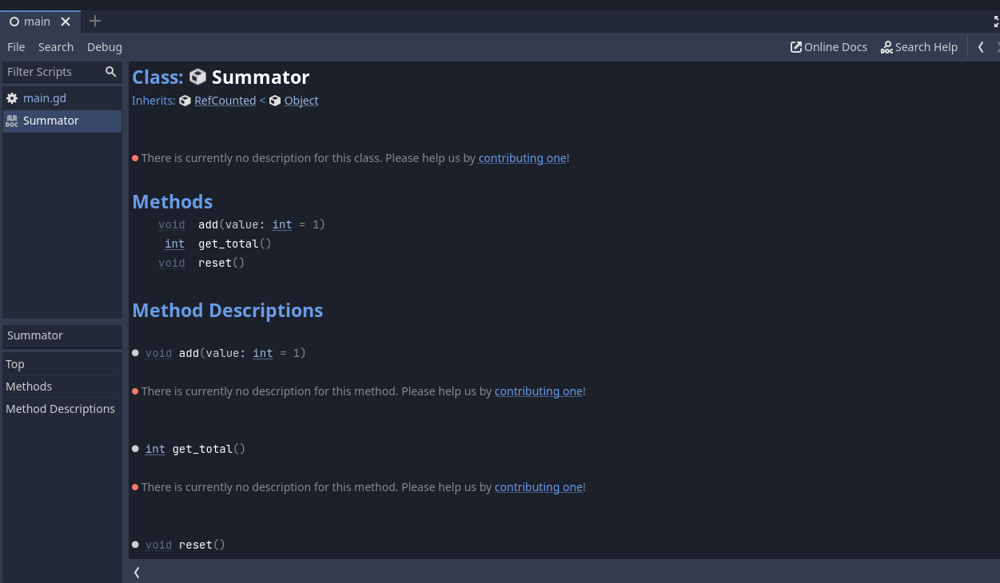

With Godot 4.0 on the horizon a lot of people want to try out the new technologies that are coming with the new version.

One of these is the GDExtension system that will be replacing the older GDNative system. GDNative was introduced as a means to enhance the editor itself by embedding C++ libraries or new language bindings into Godot. This had the advantage that users wouldn't need to build the engine themselves but import a dynamic library. The other way would be to write a custom module for Godot and compile it yourself. Both of these had their own disadvantages. GDNative doesn't have full access to the C++ engine API as modules do. On the other side, modules need to be compiled on the target computer or you need to have a CI/CD solution like GitHub Actions to compile the editor (like [GodotSteam](https://github.com/Gramps/GodotSteam) does).

Now, how's GDExtension different? It is designed to have the advantages of both modules and GDNative. You don't need to recompile the engine and you have more in-depth access to the C++ API in the Godot editor. 

Since we settled how useful GDExtension will be for the future of Godot's extensebility, let's write our first GDExtension. For this post here, we will be creating a Reference class which can add numbers together and keep track of its count.

> :warning: **Disclaimer**: I have no professional knowledge of C++. I learned everything you see from combing through the godot-cpp code and experimenting with it. Furthermore, I only guess about how the internals really are working. My recommendations for the work with GDExtension worked well for me but don't have to for you. I am not sure if they are as good as they could be. If you do have constructive criticism about this post, I will be happy to improve it.

> :memo: The code here is the same I am using for my [GDExtensionSummator template](https://github.com/paddy-exe/GDExtensionSummator). If you want to built on top of it or just jump right into the action, you can simply use the template and get a headstart.


Click on the button "Use this template" which creates a new repository to your GitHub account based on the template

## 0. Compilation requirements
To be able to compile and build your extension you will need the same software installed as you need to compile the editor itself.

This means:
* SCons
* Python 3.5+
* Git
* MinGW or Visual Studio (for **Windows**)
* Apple Command Line Tools (rather lightweight) or XCode (heavy on disk space) (for **MacOS**)

For further information, please refer to the Godot docs: [Compiling Godot](https://docs.godotengine.org/en/stable/development/compiling/index.html).

## 1. Folder structure
First and foremost you need to start with a project folder. This can be any name you want. You can also still change it later on.
In this folder you will create another folder called "extension" and in there the folder "src" where all your C++ files will be when developing the extension. You will also create another folder called "game" where your Godot project will lie. The seperation of the Godot project and the extension files is recommended for clarity and for the export of the Godot project (if you do want to develop the game side-by-side with the extension).

Your folder structure should look like this now:
```
GDExtensionSummator
 ┣ extension
 ┃ ┣ src
 ┃ ┃ ┣ ...                  <- C++ files
 ┃ ┣ game
 ┃ ┃ ┗ ...                  <- Godot project
```

## 2. godot-cpp bindings
The godot-cpp repository represents the C++ API for the Godot editor. It is built on top of the godot-headers repository (which is C based). 

We will clone the godot-cpp repo into the top folder.

> :information_source: If you want to develop your game directly side-by-side you can simply clone the main repository but if you are using git as a version-control anyway I recommend you to add godot-cpp as a submodule.

```shell
git submodule add -b master https://github.com/godotengine/godot-cpp.git
```

After that, you will need to initialize the submodule:
```
git submodule init
```

Since we are currently still in beta stage of Godot 4, the master branch isn't stable. This is the same case for godot-cpp. To make sure that the editor works as expected with the bindings, you need to checkout the specific commit of godot-cpp that is compatible with the beta version we are using. For this post, I will be using **beta 6**. You can check the snapshot commits in this pinned issue on the repository. So using beta 6 I will go into the godot-cpp folder and checkout the commit `576bd17`:

```shell
cd godot-cpp
git checkout 576bd17
```

 Now we are ready to get into the files themselves.

 ## 3. Source files
 We will start with register_types.cpp:

 ```cpp
 #include "register_types.h"
#include "summator.h"
#include <godot/gdnative_interface.h>
#include <godot_cpp/core/class_db.hpp>
#include <godot_cpp/core/defs.hpp>
#include <godot_cpp/godot.hpp>

using namespace godot;

void initialize_summator_types(ModuleInitializationLevel p_level)
{
 if (p_level != MODULE_INITIALIZATION_LEVEL_SCENE) {
  return;
 }
 ClassDB::register_class<Summator>();
}

void uninitialize_summator_types(ModuleInitializationLevel p_level) {
 if (p_level != MODULE_INITIALIZATION_LEVEL_SCENE) {
  return;
 }
}

extern "C"
{

 // Initialization.

 GDNativeBool GDN_EXPORT summator_library_init(const GDNativeInterface *p_interface, const GDNativeExtensionClassLibraryPtr p_library, GDNativeInitialization *r_initialization)
 {
  GDExtensionBinding::InitObject init_obj(p_interface, p_library, r_initialization);

  init_obj.register_initializer(initialize_summator_types);
  init_obj.register_terminator(uninitialize_summator_types);
  init_obj.set_minimum_library_initialization_level(MODULE_INITIALIZATION_LEVEL_SCENE);

  return init_obj.init();
 }
}
 ```

In lines 1 to 6 we are including several header files. The first one is the **register_types** header file which defines the functions we are calling here. Also, we are including summator.h which is our extension header file so that we can register the class type to Godot. Line 3 to 6 are the basic ones we need to include to get the Extension to work. They represent the interface to interact with the Godot editor.

Line 8 defines the namespace godot for all the godot classes we are calling here. This isn’t necessary but makes it easier to call them without writing ``godot::`` in front of everything.

In line 10 we are writing the function ``initialize_summator_types`` in which we are registering the custom classes we are writing so that Godot knows of their existence. In line 18 you would call the uninitialized function. Since we are only writing a Custom Reference class we don’t have to write anything specific here. It can however be very important for the memory management of your extension.

Line 29 calls a function ``summator_library_init`` of type ``GDNativeBool``. In essence, this function creates a Binding Object for the extension and does the registration to Godot’s internals for us. The name of the function is important for later so choose a fitting name for your extension.

### ``register_types.h``
```cpp
#ifndef SUMMATOR_REGISTER_TYPES_H
#define SUMMATOR_REGISTER_TYPES_H

void initialize_summator_types();
void uninitialize_summator_types();

#endif // SUMMATOR_REGISTER_TYPES_H
```

This header file is rather simple. C++ Macros are defined (I am not sure why and if they need to be there). Other than that, the functions for the cpp file are defined here.

### ``summator.h``
```cpp
//© Copyright 2014-2022, Juan Linietsky, Ariel Manzur and the Godot community (CC-BY 3.0)
#ifndef SUMMATOR_CLASS_H
#define SUMMATOR_CLASS_H

#include <godot_cpp/classes/ref.hpp>

using namespace godot;

class Summator : public RefCounted
{
    GDCLASS(Summator, RefCounted);

    int count;

protected:
    static void _bind_methods();

public:
    Summator();
    ~Summator();

    void add(int p_value);
    void reset();
    int get_total() const;
};

#endif // SUMMATOR_CLASS_H
```

In line 2 and 3 we define the Summator class macro if it doesn’t already exist.

In line 5 we include the Ref(erence) header file from the Godot API.

In line 9 creates a class Summator which inherits from the class RefCounted (from the Ref.hpp header file). In it, we call ``GDCLASS`` which is a internal Godot template macro to handle the class. Next, we also create an integer called ``count`` in line 19. This integer will hold the sum of the numbers we add to our Reference object.

Line 22 shows the ``_bind_methods`` static method which is Godot’s internal method to bind well… methods to classes. This has to be added so that methods and properties can be bound to the class.

Line 24 to 30 define the constructor and deconstructor of the Summator class as well as the methods for this class.

### ``summator.cpp``
```cpp
//© Copyright 2014-2022, Juan Linietsky, Ariel Manzur and the Godot community (CC-BY 3.0)
#include "summator.h"

#include <godot_cpp/core/class_db.hpp>

using namespace godot;

Summator::Summator()
{
    count = 0;
}

Summator::~Summator()
{
}

void Summator::add(int p_value)
{
    count += p_value;
}

void Summator::reset()
{
    count = 0;
}

int Summator::get_total() const
{
    return count;
}

void Summator::_bind_methods()
{
    ClassDB::bind_method(D_METHOD("add", "value"), &Summator::add, DEFVAL(1));
    ClassDB::bind_method(D_METHOD("reset"), &Summator::reset);
    ClassDB::bind_method(D_METHOD("get_total"), &Summator::get_total);
}
```

In line 4 we include ``class_db.hpp`` which is sort of like a class database of Godot. We call this class to bind methods and properties of custom types so that the Godot editor knows of them.

Line 8 creates the constructor of the Summator class with a default value for the count variable.

In line 13 we write the Deconstructor of Summator which doesn’t have any contents.

In line 17 the ``add()`` method is written so that the argument of it will be added to the count variable.

Line 22’s ``reset()`` method resets the count variable to the value 0.

Line 27’s ``get_total()`` returns the current value of the count variable.

In line 32 to 36 we write the ``_bind_methods`` method to bind the custom class methods we have written above.

The syntax for ``_bind_method`` is as follows:
```cpp
ClassDB::bind_method(D_METHOD("method_name", "optional argument_name"), &Summator::method_name, DEFVAL(default_argument_value));
```

``D_METHOD`` is a Godot internal template.

### ``SConstruct``

This file here is sort of the heart of your extension. It’s a python file (yes, even though it doesn’t have a .py ending). It tells the build process how to compile your files. It is very clever though and can figure out which files first to compile if they depend on each other in their functionality.

```py
#!/usr/bin/env python
import os
import sys

env = SConscript("godot-cpp/SConstruct")

# For the reference:
# - CCFLAGS are compilation flags shared between C and C++
# - CFLAGS are for C-specific compilation flags
# - CXXFLAGS are for C++-specific compilation flags
# - CPPFLAGS are for pre-processor flags
# - CPPDEFINES are for pre-processor defines
# - LINKFLAGS are for linking flags

# tweak this if you want to use different folders, or more folders, to store your source code in.
env.Append(CPPPATH=["extension/src/"])
sources = Glob("extension/src/*.cpp")

if env["platform"] == "macos":
    library = env.SharedLibrary(
        "game/bin/summator/libgdsummator.{}.{}.framework/libgdsummator.{}.{}".format(
            env["platform"], env["target"], env["platform"], env["target"]
        ),
        source=sources,
    )
else:
    library = env.SharedLibrary(
        "game/bin/summator/libgdsummator{}{}".format(env["suffix"], env["SHLIBSUFFIX"]),
        source=sources,
    )

Default(library)
```

The first line here is the famous shebang line which tells your operating system which interpreter it should be run by.

Line 2 and 3 are includes to handle operating system and system functions.

In line 5 we create an object for the build configuration of our extension which is available in the godot-cpp repository. This build configuration tells Scons how to compile the extension.

Now that we have created the compilation environment, we need to add paths to it so it knows where to search for files to compile. This is what line 6 and 7 are for. You can append several file paths to your own SConstruct file. ``Glob`` searches for specific file patterns in a given file path.

The lines 9 to 20 define how the library will be named when compiled. You can see flags like ``platform``, ``target`` or ``suffix`` which will come in handy later. Since MacOS is a little bit different in terms of naming everything, it has a specific if statement block.

Line 22 is the Default target selection mechanism. Scons will use its own algorithm to determine the target specifics. So for instance if I just run:

```shell
scons
```

Scons will actually run this in the background (plus a little more):

```shell
scons platform=windows target=template_debug -j11
```

It can also automatically determine the number of my cores (which is 12) and set it to -1 of this number to run the compilation and speed it up since it can use more than one core. Quite clever, isn’t it?

## 4. Compiling your extension

Since we now have everything together to be able to build our extension, let’s do that, shall we?

First off, we need to build the godot-cpp. In your terminal you should go into the godot-cpp directory now and run:

```shell
scons # add -jN with N for the number of cores you want to use
```

You should see the following:

```
scons: Reading SConscript files …
Auto-detected 12 CPU cores available for build parallelism. Using 11 cores by default. You can override it with the -j argument.
Building for architecture x86_64 on platform windows
scons: done reading SConscript files.
scons: Building targets …
```

After that, a huge pile of text should appear and then all of a sudden:

```shell
scons: done building targets.
```

The huge pile of text are the object files that were created for the compilation of the godot-cpp library. This step is also necessary to get autocompletion working for your code editor.

Next, we go in the top directory and run scons again. This time we are compiling the actual extension. The procedure and outcome message should be the same as for the godot-cpp library. (If you do get any errors up until now, leave either a comment here or hit me up on [Twitter](https://twitter.com/patrick_exe) or [Mastodon](@flamelizard@mastodon.gamedev.place))

## 5. The extension file

The last step is this here. You need to create a summator.gdextension file which you put in the ``bin/`` folder. This file tells your Godot editor where to load your extension from. You can set different targets depending on release and debug (just like the editor itself). The file should look like this:

```yml
[configuration]

entry_symbol = "summator_library_init"

[libraries]

linux.x86_64.debug = "res://bin/summator/libgdsummator.linux.template_debug.x86_64.so"
linux.x86_64.release = "res://bin/summator/libgdsummator.linux.template_release.x86_64.so"
linux.debug.arm64 = "res://bin/summator/libgdsummator.linux.template_debug.arm64.so"
linux.release.arm64 = "res://bin/summator/libgdsummator.linux.template_release.arm64.so"
windows.x86_64.debug = "res://bin/summator/libgdsummator.windows.template_debug.x86_64.dll"
windows.x86_64.release = "res://bin/summator/libgdsummator.windows.template_release.x86_64.dll"
macos.debug = "res://bin/summator/libgdsummator.macos.template_debug.framework"
macos.release = "res://bin/summator/libgdsummator.macos.template_release.framework"
```

The ``[configuration]`` part with the entry_symbol variable is the function that will get called to load the extension. We defined this method ealier in the register_types.cpp file.

The ``[libraries]`` part is where you set the versions and flags you want to use for your extension. You can customize this a lot to your needs with the use of your SConstruct file. With that, you can release your extension for MacOS, Windows and Linux as both debug and release versions.

## 6. Using the extension

Now let’s open Godot 4.0 beta 6 again and we see … nothing?
Well, we need to add a script first to use the Summator reference type.

You can create a simple scene with a Node type as Scene root (any is fine really) and add a script to it. In the script editor, you can now create a new Summator class instance and add numbers to it via the add() method. You can print out the count by calling the get_total() method. This should look similar to this screenshot:


Congratulation🎉🎉🎉You created your first extension!

As a little bonus: When Ctrl+Clicking on the Summator class you can get this here:



Yes, your GDExtension automatically creates docs for you. Adding descriptions isn’t yet possible unfortunately but this is already very cool and useful.

**Thank you very much for reading!**

If this blog post was helpful to you, I’d really appreciate a message, a like where I shared this post or you can support me by buying me a coffee :D.

I have plans to add more tutorials as well (in VFX and Shaders especially) so stay tuned!

